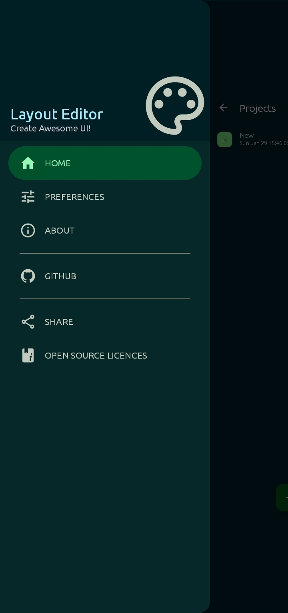
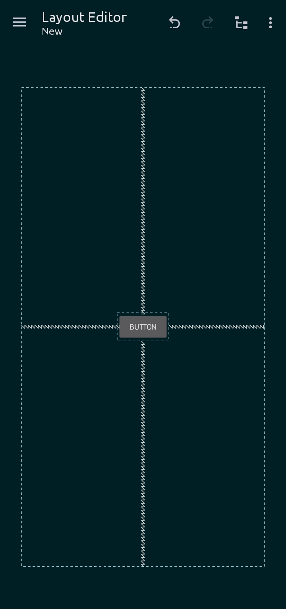
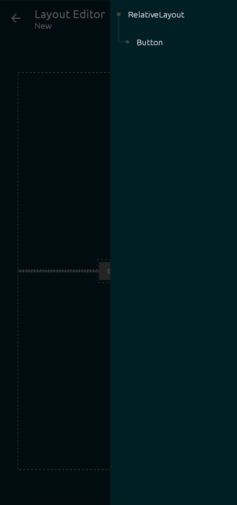
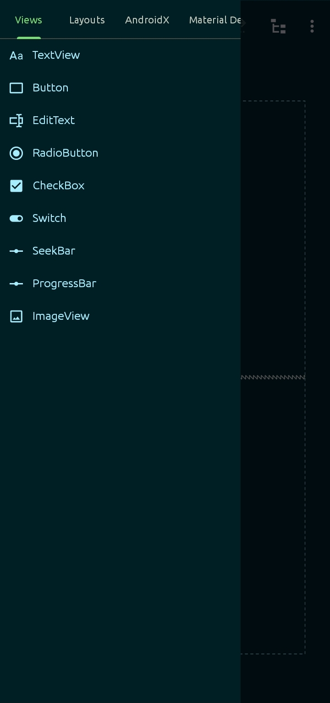
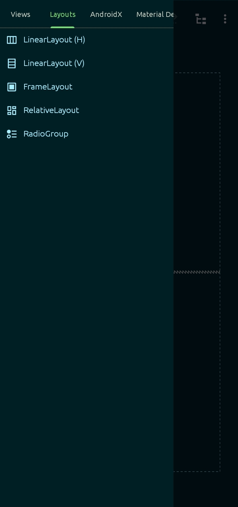
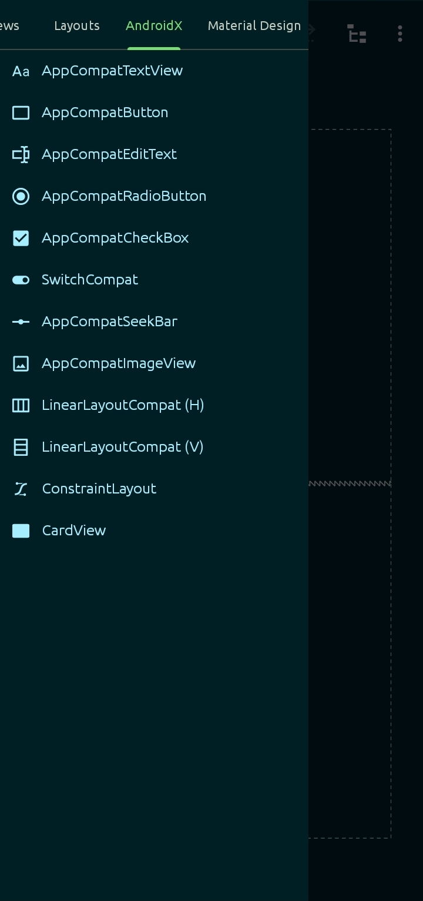
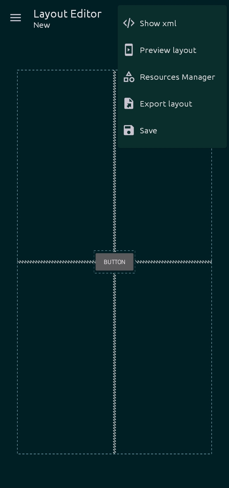
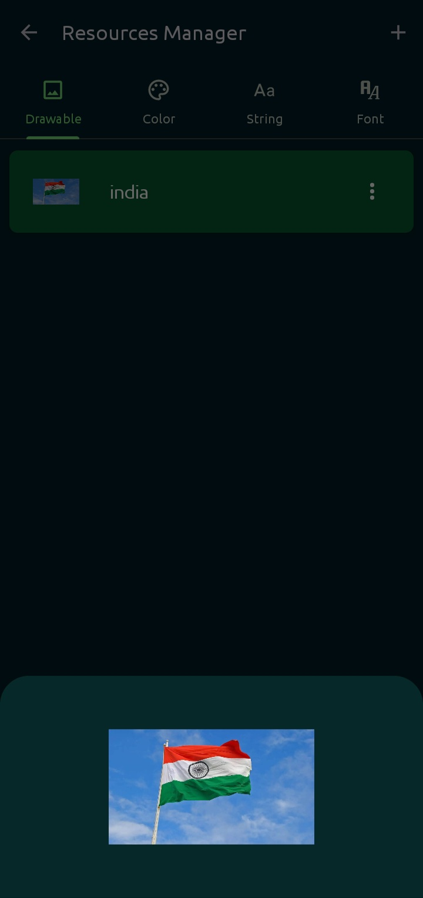
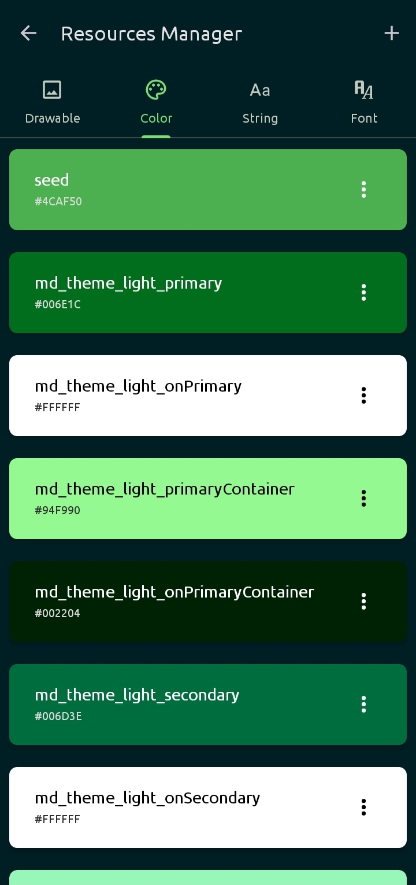
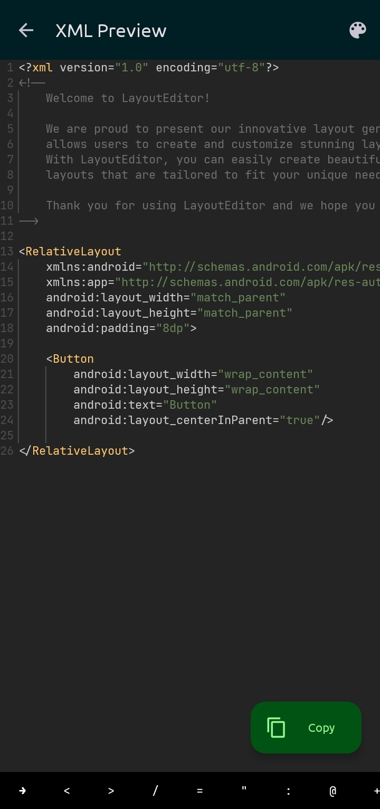

<div align="center">

[](https://github.com/itsvks19/LayoutEditor/releases/latest)


[](https://github.com/itsvks19/LayoutEditor/blob/main/CODE_OF_CONDUCT.md)
[](https://github.com/itsvks19/LayoutEditor/blob/main/LICENSE)
</div>

Use Layout Editor to easily build Android app layouts by dragging UI elements into a visual layout editor.

### Features
- Design layout with Drag & Drop
- Edit view and layout properties
- See and Copy the XML code of layout
- Save and use drawables
- See the layout structure
- Save layouts as projects
- Preview Layout in devices
- Export layouts as XML

### Screenshots
<div align="center">












</div>

### TODO
- [ ] Create custom widgets and components
- [ ] Group and organize views and layouts
- [ ] Use custom themes and styles
- [ ] Set constraints on views
- [ ] Test and debug layouts
- [X] Export layouts as images
- [ ] Create multi-screen layouts
- [ ] Add support for multiple languages
- [ ] Share layouts with other users
- [ ] Automatically generate layouts from code
- [ ] Reuse existing layouts and elements
- [ ] Add support for third-party libraries
- [ ] Add support for device orientation
- [ ] Create custom layout wizards
- [ ] Create interactive and dynamic layouts
- [ ] Create custom view groups
- [ ] Integrate with existing development tools
- [X] Generate code from layouts
- [ ] Add support for custom transitions
- [ ] Generate responsive layouts
- [ ] Add gesture-based interactions
- [ ] Create complex data-driven layouts
- [X] Import existing layouts
- [ ] Add support for third-party libraries
- [ ] Add support for custom view components
- [X] Add support for testing layouts
- [ ] Create custom animations
- [X] Customize view properties
- [ ] Add support for custom plugins
- [X] Add support for undo/redo
- [ ] Add support for custom fonts
- [ ] Add support for creating custom widgets
- [ ] Add support for creating custom icons
- [ ] Add support for creating custom themes
- [ ] Add support for creating custom shapes
- [ ] Add support for creating custom colors
- [X] Add support for creating custom layouts
- [ ] Add support for creating custom layout templates

**Known issues**:
1. `ConstraintLayout` is not usable right now.
2. Only a few widgets have been added. More will be added soon.
3. Not all attributes of widgets are available.

The app is in alpha.
You may face issues when using the app. If you do, please report it in github [issues](https://github.com/itsvks19/LayoutEditor/issues).

[](https://github.com/itsvks19/LayoutEditor/releases/latest)

### Thanks to
- [Kerismaker](https://www.flaticon.com/authors/kerismaker) for the nice [icon](https://www.flaticon.com/free-icon/template_6863985)
- [Rosemoe](https://github.com/Rosemoe) for [sora-editor](https://github.com/Rosemoe/sora-editor)
- [Akash Yadav](https://github.com/itsaky) for the awesome [AndroidIDE](https://github.com/AndroidIDEOfficial/AndroidIDE)

### Lisence
```
LayoutEditor - Create Awesome UI!
Copyright (C) 2022-2023  Vivek Kumar Sahani & Deep Kr. Ghosh

This program is free software: you can redistribute it and/or modify
it under the terms of the GNU General Public License as published by
the Free Software Foundation, either version 3 of the License, or
(at your option) any later version.

This program is distributed in the hope that it will be useful,
but WITHOUT ANY WARRANTY; without even the implied warranty of
MERCHANTABILITY or FITNESS FOR A PARTICULAR PURPOSE.  See the
GNU General Public License for more details.

You should have received a copy of the GNU General Public License
along with this program.  If not, see <https://www.gnu.org/licenses/>.
```
