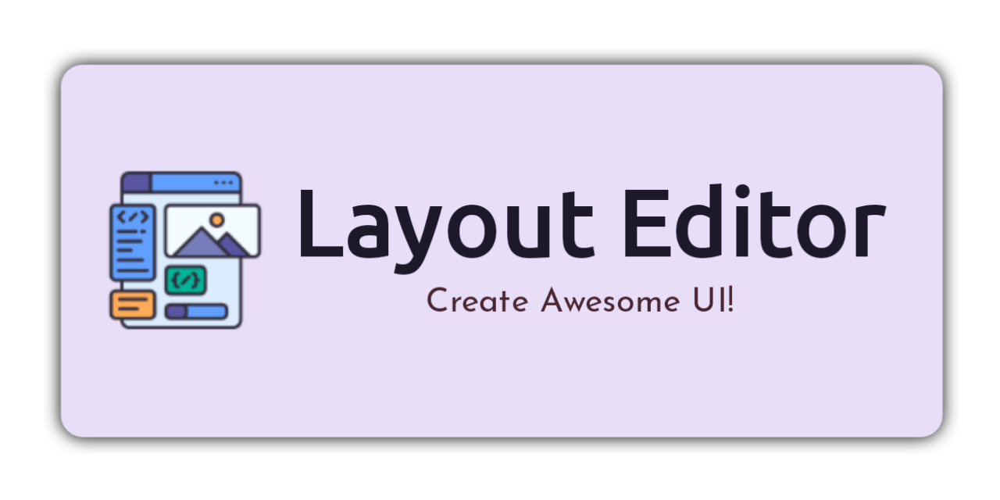

<div align="center">

[](https://github.com/itsvks19/LayoutEditor/releases/latest)
[](https://discord.gg/EdeVQSghMA)


[](https://github.com/itsvks19/LayoutEditor/blob/main/CODE_OF_CONDUCT.md)
[](https://github.com/itsvks19/LayoutEditor/blob/main/LICENSE)
</div>

Use Layout Editor to easily build Android app layouts by dragging UI elements into a visual layout editor.

### Features
- [X] Drag and drop: The Layout Editor allows developers to easily drag and drop UI elements onto the design canvas, making it easy to create a visual representation of the app's layout.
- [X] WYSIWYG editing: The Layout Editor provides a What You See Is What You Get (WYSIWYG) interface, which allows developers to preview how their app will look on different devices.
- [X] Blueprint mode: In addition to the WYSIWYG mode, the Layout Editor also has a blueprint mode that allows developers to work with a wireframe view of the layout.
- [ ] Design tools: The Layout Editor provides a range of design tools, including alignment guides, snap-to-grid functionality, and a range of layout templates to make it easier to create professional-looking layouts.
- [ ] Theme editing: Developers can modify the theme of their app's layout by selecting from a range of pre-built themes or creating their own custom theme.
- [X] Component properties: The Layout Editor provides a range of component properties that developers can modify, including size, padding, margins, and more.
- [X] Preview mode: Developers can preview their app's layout on a range of devices, including smartphones, tablets, and wearables, to ensure that it looks good on all screen sizes.
- [ ] Code editing: The Layout Editor also allows developers to switch to code mode and manually edit the layout's XML code.
- [ ] Accessibility tools: The Layout Editor includes a range of accessibility tools to help developers ensure that their app's layout is accessible to all users, including those with disabilities.
- [ ] Layout validation: The Layout Editor includes a layout validation tool that can identify common layout issues and suggest ways to fix them.

**Known issues**:
1. Only a few widgets have been added. More will be added soon.
2. Not all attributes of widgets are available.

The app is in alpha.
You may face issues when using the app. If you do, please report it in github [issues](https://github.com/itsvks19/LayoutEditor/issues).

[](https://github.com/itsvks19/LayoutEditor/releases/latest)

### Thanks to
- [Kerismaker](https://www.flaticon.com/authors/kerismaker) for the nice [icon](https://www.flaticon.com/free-icon/template_6863985)
- [Rosemoe](https://github.com/Rosemoe) for [sora-editor](https://github.com/Rosemoe/sora-editor)
- [Akash Yadav](https://github.com/itsaky) for the awesome [AndroidIDE](https://github.com/AndroidIDEOfficial/AndroidIDE)

### Lisence
```
LayoutEditor - Create Awesome UI!
Copyright (C) 2022-2023  Vivek Kumar Sahani & Deep Kr. Ghosh

This program is free software: you can redistribute it and/or modify
it under the terms of the GNU General Public License as published by
the Free Software Foundation, either version 3 of the License, or
(at your option) any later version.

This program is distributed in the hope that it will be useful,
but WITHOUT ANY WARRANTY; without even the implied warranty of
MERCHANTABILITY or FITNESS FOR A PARTICULAR PURPOSE.  See the
GNU General Public License for more details.

You should have received a copy of the GNU General Public License
along with this program.  If not, see <https://www.gnu.org/licenses/>.
```
